# Hey, I'm Gurpreet Singh 👋

### AI & Full-Stack Developer | CSE Student

---

## 🚀 About Me

I'm a Computer Science Engineering student interested in building
practical software and AI-powered applications.

- 🤖 Exploring **Generative AI, Machine Learning & AI Engineering**
- 🧠 Working with **RAG, Agentic AI, LLMs & AI APIs**
- 💻 Building full-stack applications with **React, Node.js & FastAPI**
- 🛠️ Interested in **backend engineering, system design & software engineering**
- 📚 Currently strengthening my **DSA & problem-solving skills**

---

## 🛠️ Tech Stack

### 💻 Languages & Web

  

### ⚛️ Frontend

  

### ⚙️ Backend

  

### 🗄️ Databases

  

### 🤖 AI / Machine Learning

  
  
  
  
  
  
  

### 🔧 Tools & Engineering

  

  
  
  

---

## 🚀 Featured Projects

### 💼 HireTrack

**AI-Powered Job Application Tracker**

A full-stack MERN application with secure authentication,
ownership-scoped authorization and an AI-powered resume–JD matcher
using Gemini.

**Highlights**

- 🔐 JWT authentication & ownership-based access control
- 🤖 AI resume–JD matching with Gemini
- 📄 Server-side PDF text extraction
- 🛡️ API rate limiting & secure session handling
- 🧪 Jest testing & GitHub Actions CI

**Stack:** `React` `Node.js` `Express` `MongoDB` `Gemini API` `JWT`

[🔗 Repository](https://github.com/Guru2907/HireTrack)  
[🌐 Live Demo](https://hiretrack-black.vercel.app/)

---

### 🧠 Orbit AI

**RAG-Powered SaaS Support Assistant**

A full-stack AI support application that retrieves relevant
documentation and uses it to generate grounded responses.

**Highlights**

- 🔎 Semantic document retrieval with ChromaDB
- 🧠 Gemini-powered embeddings & generation
- 🎯 Retrieval relevance thresholding
- 🔐 JWT authentication & bcrypt
- 🗄️ PostgreSQL persistence
- ☁️ Deployed frontend and backend architecture

**Stack:** `Python` `FastAPI` `React` `Gemini` `ChromaDB` `PostgreSQL` `JWT`

[🔗 Repository](https://github.com/Guru2907/Orbit-AI)  
[🌐 Live Demo](https://orbit-ai-flowspace.vercel.app/)

---

## 📊 GitHub Stats

---

## 🐍 Contribution Graph

<picture>
  <source
    media="(prefers-color-scheme: dark)"
    srcset="https://raw.githubusercontent.com/Guru2907/Guru2907/output/github-snake-dark.svg"
  />
  <source
    media="(prefers-color-scheme: light)"
    srcset="https://raw.githubusercontent.com/Guru2907/Guru2907/output/github-snake.svg"
  />
  
</picture>

---

## 🤝 Let's Connect

---

### 🚀 Learn. Build. Ship. Repeat.

